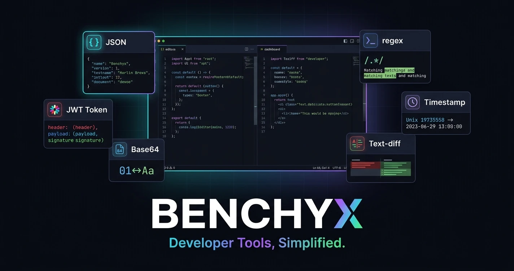

<p align="center">
  
</p>

<h1 align="center">Benchyx</h1>
<p align="center">
  Free online developer tools — JSON, JWT, Base64, Regex, Timestamps, Diff, UUID, Hash, Color, Base
</p>
<p align="center">
  <a href="https://maku85.github.io/benchyx/">maku85.github.io/benchyx</a>
</p>

A minimalist developer tools workspace — a web-based suite of utilities for common developer tasks, with a dark-themed UI and responsive split-panel layout.

## Tools

| Tool | Description |
|------|-------------|
| **JSON** | Format (pretty-print) or minify JSON with live validation |
| **JWT** | Decode JWT tokens — header, payload, signature, expiry info |
| **Encode** | Base64 and URL encode/decode |
| **Regex** | Test regex patterns with live match highlighting and flags (g, i, m) |
| **Time** | Convert Unix timestamps and ISO 8601 strings, with local/UTC toggle |
| **Diff** | Side-by-side text diff using LCS algorithm, with unified copy |
| **UUID** | Generate v4 UUIDs in bulk, with uppercase/no-dashes formatting |
| **Hash** | SHA-1, SHA-256, SHA-384 and SHA-512 digests via the Web Crypto API |
| **Color** | Convert between HEX, RGB and HSL, with a native color picker and preview |
| **Base** | Convert numbers between binary, octal, decimal and hexadecimal |

## Stack

- **Next.js 16** (App Router, React Server Components)
- **React 19**
- **TypeScript 5** (strict mode)
- **Tailwind CSS v4**
- **shadcn/ui** + **Radix UI**
- **Lucide React** icons

## Getting Started

```bash
pnpm install
pnpm dev
```

Open [http://localhost:3000](http://localhost:3000).

## Project Structure

```
src/
├── app/          # Next.js App Router (layout, page, global styles)
├── components/   # Shared UI (Sidebar, Toolbar, SplitPanel, Workspace)
│   └── ui/       # shadcn/ui primitives (Button, ...)
├── tools/        # One directory per tool (json, jwt, encode, regex, time, diff, uuid, hash, color, numberbase)
└── lib/          # Utilities (cn helper)
```
